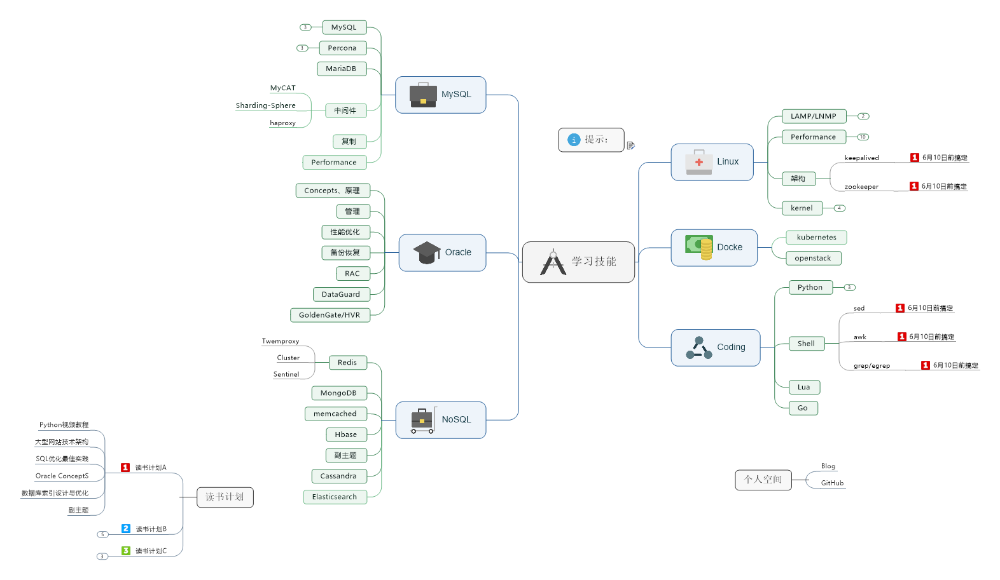

# **GalaxyGlory's Blog**  
[**Linux's Blog**](https://github.com/galaxyglory/blog/tree/master/linux)
1. linux
2. shell

[**MySQL's Blog**](https://github.com/galaxyglory/blog/tree/master/mysql)

[**NoSQL's Blog**](https://github.com/galaxyglory/blog/tree/master/nosql)

[**Oracle's Blog**](https://github.com/galaxyglory/blog/tree/master/oracle)

[**Python's Blog**](https://github.com/galaxyglory/blog/tree/master/python)

[**Shell's Blog**](https://github.com/galaxyglory/shell)

